# 🛡️ API Rate-Limit & Abuse Detection System

A production-grade API Gateway with intelligent rate limiting, automatic abuse detection, IP reputation tracking, and real-time monitoring dashboard built in Go.


---

## 📋 Table of Contents

- [Problem Statement](#-problem-statement)
- [Solution Overview](#-solution-overview)
- [Architecture](#-architecture)
- [How It Works](#-how-it-works)
- [Features](#-features)
- [Quick Start](#-quick-start)
- [API Reference](#-api-reference)
- [Dashboard](#-dashboard)
- [Configuration](#-configuration)
- [Real-World Use Cases](#-real-world-use-cases)

---

## 🎯 Problem Statement

Modern APIs face critical challenges:

| Problem | Impact | Without Protection |
|---------|--------|-------------------|
| **DDoS Attacks** | Server crashes | Millions of requests overwhelm servers |
| **Brute Force** | Security breach | Unlimited login attempts |
| **Data Scraping** | Data theft | Competitors steal your data |
| **Resource Abuse** | High costs | Single user consumes all resources |
| **Bot Traffic** | Poor UX | Real users can't access services |

---

## 💡 Solution Overview

This system acts as a **security gateway** between users and your backend API:


---

## 🏗️ Architecture

### High-Level System Architecture


### Request Processing Flow


### Middleware Chain


---

## ⚙️ How It Works

### 1. Rate Limiting (Sliding Window Algorithm)


### 2. IP Reputation System

```mermaid
flowchart TD
    A[New IP Detected] --> B[Score: 100<br/>Perfect]
    
    B --> C{Request Outcome}
    
    C -->|Success 200| D[Score Unchanged]
    C -->|Blocked 429| E[Score -= 5]
    
    D --> F{Check Thresholds}
    E --> F
    
    F -->|Score < 30| G[🚨 SUSPICIOUS]
    F -->|Blocks >= 5| G
    F -->|Blocks >= 20| H[🚫 AUTO-BLOCKED]
    F -->|Normal| I[✅ OK]
    
    style A fill:#e3f2fd
    style B fill:#c8e6c9
    style G fill:#fff3e0
    style H fill:#ffcdd2
    style I fill:#e8f5e9
```



### 3. Multi-Tier Rate Limits


### 4. Abuse Detection Flow


---

## ✨ Features

### Core Features

| Feature | Description |
|---------|-------------|
| 🚦 **Sliding Window Rate Limiting** | Redis-based atomic counters using Lua scripts |
| 🔍 **IP Reputation Tracking** | Automatic scoring and suspicious IP detection |
| 🚫 **Auto-Block** | IPs with 20+ blocks are automatically banned |
| 🎫 **JWT & API Key Auth** | Flexible authentication options |
| 📊 **Real-time Dashboard** | Beautiful UI for monitoring |
| 📝 **Request Logging** | Every request gets a unique ID |
| 🌐 **Reverse Proxy** | Forward requests to backend services |

### Complete Feature Flow


---

## 🚀 Quick Start

### Prerequisites

- Go 1.21+
- Redis (for rate limiting)
- PostgreSQL (optional, for persistence)

### 1. Clone & Install

```bash
git clone https://github.com/berserk3142-max/API-Rate-Limit-Abuse-Detection-System.git
cd API-Rate-Limit-Abuse-Detection-System
go mod tidy
```

### 2. Start Redis (Docker)

```bash
docker run -d --name redis -p 6379:6379 redis
```

### 3. Run the Server

```bash
go run main.go
```

### 4. Open Dashboard

```
http://localhost:8080/dashboard
```

---

## 🐳 Docker Deployment

### Quick Docker Start

```bash
# Clone the repository
git clone https://github.com/berserk3142-max/API-Rate-Limit-Abuse-Detection-System.git
cd API-Rate-Limit-Abuse-Detection-System

# Start all services with Docker Compose
docker-compose up -d

# View logs
docker-compose logs -f api-gateway
```

### Docker Architecture


### Services Included

| Service | Port | Purpose |
|---------|------|---------|
| **api-gateway** | 8080 | Main application |
| **redis** | 6379 | Rate limiting cache |
| **postgres** | 5432 | Persistent storage |
| **kafka** | 9092 | Event streaming |
| **zookeeper** | 2181 | Kafka coordination |

### Build Only the API Gateway

```bash
# Build the Docker image
docker build -t api-gateway .

# Run with environment variables
docker run -d \
  --name api-gateway \
  -p 8080:8080 \
  -e REDIS_ADDR=your-redis-host:6379 \
  -e POSTGRES_DSN=your-postgres-dsn \
  api-gateway
```

### Production Configuration

Create a `.env` file from the template:

```bash
cp .env.example .env
# Edit .env with your production values
```

Key production considerations:
- Use external managed Redis (e.g., Redis Cloud, AWS ElastiCache)
- Use Neon or managed PostgreSQL
- Set strong `JWT_SECRET`
- Configure proper `BACKEND_URL`

---

## 📡 API Reference

### Endpoint Overview


### Health Check

```http
GET /health
```

**Response:**
```json
{
  "status": "healthy",
  "service": "api-gateway",
  "total_requests": 150,
  "blocked_requests": 5
}
```

### Admin Endpoints

#### Get All Tracked IPs

```http
GET /admin/all-ips
```

#### Get IP Risk Score

```http
GET /admin/ip-risk?ip=192.168.1.1
```

**Response:**
```json
{
  "ip": "192.168.1.1",
  "reputation_score": 85,
  "is_blocked": false,
  "is_suspicious": false,
  "total_requests": 100,
  "blocked_requests": 3,
  "user_agents": ["Mozilla/5.0...", "curl/8.0"],
  "first_seen": "2026-01-22T00:00:00Z",
  "last_seen": "2026-01-22T01:30:00Z"
}
```

#### Get Suspicious IPs

```http
GET /admin/suspicious-ips
```

#### Block an IP

```http
POST /admin/blocked-ips
Content-Type: application/json

{
  "ip": "192.168.1.100",
  "reason": "Suspicious bot activity"
}
```

#### Unblock an IP

```http
POST /admin/unblock
Content-Type: application/json

{
  "ip": "192.168.1.100"
}
```

#### Get Recent Requests

```http
GET /admin/recent-requests
```

---

## ⚙️ Configuration

### Environment Variables

| Variable | Default | Description |
|----------|---------|-------------|
| `SERVER_PORT` | 8080 | Server listen port |
| `REDIS_ADDR` | localhost:6379 | Redis address |
| `REDIS_PASSWORD` | "" | Redis password |
| `POSTGRES_DSN` | - | PostgreSQL connection string |
| `JWT_SECRET` | your-secret-key | JWT signing secret |
| `BACKEND_URL` | http://localhost:9000 | Backend service URL |
| `RATE_LIMIT_WINDOW` | 60 | Window in seconds |
| `RATE_LIMIT_MAX` | 100 | Max requests per window |

---

## 🌍 Real-World Use Cases

### Use Case Flow


---

## 🔧 Response Headers

Every response includes rate limit headers:

```http
X-RateLimit-Limit: 100        # Max requests allowed
X-RateLimit-Remaining: 95     # Requests remaining
X-RateLimit-Reset: 1642857600 # Unix timestamp for reset
```

When rate limited (429 response):
```http
Retry-After: 60               # Seconds until retry
```

---

## 📝 License

MIT License - See [LICENSE](LICENSE) for details.

---

## 🤝 Contributing

1. Fork the repository
2. Create your feature branch (`git checkout -b feature/amazing`)
3. Commit your changes (`git commit -m 'Add amazing feature'`)
4. Push to the branch (`git push origin feature/amazing`)
5. Open a Pull Request

---

<p align="center">
  Built with ❤️ using Go, Redis, and modern web technologies
</p>
